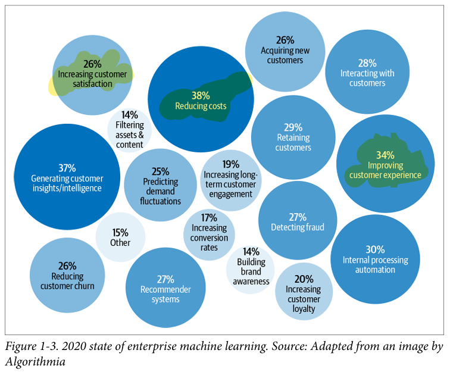

* Since then, more and more companies have turned toward ML for solutions to their
most challenging problems.

* Yet there are still many more use cases for ML waiting to be
explored in fields such as health care, transportation, farming, and even in helping us
understand the universe.2

---
## The Relationship Between MLOps and ML Systems Design
--
* Ops in MLOps comes from DevOps, short for Developments and
Operations. To operationalize something means to bring it into
production, which includes deploying, monitoring, and maintain
ing it. MLOps is a set of tools and best practices for bringing ML
into production.

---
* 

---

## When to Use Machine Learning
---
* As its adoption in the industry quickly grows, ML has proven to be a powerful tool
for a wide range of problems. Despite an incredible amount of excitement and hype
generated by people both inside and outside the field, ML is not a magic tool that can
solve all problems. 

```
Machine learning is an approach to (1) learn (2) complex patterns from (3) existing
data and use these patterns to make (4) predictions on (5) unseen data.
```
```
ML systems learn from data
```

1. Learn: the system has the capacity to learn

```
A relational database isn’t an ML system because it doesn’t have the capacity
to learn. 
```

2. Complex patterns: there are patterns to learn, and they are complex

```
ML has been very successful with tasks with complex patterns such as object
detection and speech recognition
```

3. Existing data: data is available, or it’s possible to collect data

```
Because ML learns from data, there must be data for it to learn from.
```

4. Predictions: it’s a predictive problem

```
ML models make predictions, so they can only solve problems that require
predictive answers.
```

5. Unseen data: unseen data shares patterns with the training data
```
The patterns your model learns from existing data are only useful if unseen data
also share these patterns.
```
6. It’s repetitive

7. The cost of wrong predictions is cheap

```
 ML is
especially suitable when the cost of a wrong prediction is low.

Developing self-driving cars is challenging because an
algorithmic mistake can lead to death. However, many companies still want to
develop self-driving cars because they have the potential to save many lives once
self-driving cars are statistically safer than human drivers.
```

8. It’s at scale

```
“At scale” means different things for different tasks, but, in general, it means
making a lot of predictions. Examples include sorting through millions of emails
a year or predicting which departments thousands of support tickets should be
routed to a day.
```

9. The patterns are constantly changing
```
Cultures change. Tastes change. Technologies change. What’s trendy today might
be old news tomorrow. Consider the task of email spam classification. Today
an indication of a spam email is a Nigerian prince, but tomorrow it might be a
distraught Vietnamese writer.
```

##### Most ImP
```
“Continual Learning”
```
### Machine Learning Use Cases

* ML has found increasing usage in both enterprise and consumer applications. Since
the mid-2010s, there has been an explosion of applications that leverage ML to
deliver superior or previously impossible services to consumers.


* ML is increasingly present in our homes with smart personal assistants such as Alexa
and Google Assistant. Smart security cameras can let you know when your pets leave
home or if you have an uninvited guest. 

---

---


```
Fraud detection is among the oldest applications of ML in the enterprise world. If
your product or service involves transactions of any value, it’ll be susceptible to
fraud. By leveraging ML solutions for anomaly detection, you can have systems that
learn from historical fraud transactions and predict whether a future transaction is
fraudulent.
```

### Understanding Machine Learning Systems

```
Understanding ML systems will be helpful in designing and developing them. In this
section, we’ll go over how ML systems are different from both ML in research (or
as often taught in school) and traditional software, which motivates the need for this
book.
```

### Machine Learning in Research Versus in Production

```
As ML usage in the industry is still fairly new, most people with ML expertise have
gained it through academia: taking courses, doing research, reading academic papers.
```

### ML engineers
```
Want a model that recommends restaurants that users will most likely order
from, and they believe they can do so by using a more complex model with more
data.
```

### Sales team
```
Wants a model that recommends the more expensive restaurants since these
restaurants bring in more service fees.
```

### Product team
```
Notices that every increase in latency leads to a drop in orders through the
service, so they want a model that can return the recommended restaurants in
less than 100 milliseconds.
```

### ML platform team
```
As the traffic grows, this team has been woken up in the middle of the night
because of problems with scaling their existing system, so they want to hold off
on model updates to prioritize improving the ML platform.
```

### Manager
```
Wants to maximize the margin, and one way to achieve this might be to let go of
the ML team.
```

---
## Machine Learning Systems Versus Traditional Software
---
```
* Since ML is part of software engineering (SWE), and software has been successfully
used in production for more than half a century, some might wonder why we don’t
just take tried-and-true best practices in software engineering and apply them to ML.
That’s an excellent idea. In fact, ML production would be a much better place if ML
experts were better software engineers. Many traditional SWE tools can be used to
develop and deploy ML applications.

* In traditional SWE, you only need to focus on testing and versioning your code. With
ML, we have to test and version our data too, and that’s the hard part. How to version
large datasets? How to know if a data sample is good or bad for your system?

* The size of ML models is another challenge. As of 2022, it’s common for ML models
to have hundreds of millions, if not billions, of parameters, which requires gigabytes
of random-access memory (RAM) to load them into memory. A few years from now,
a billion parameters might seem quaint—like, “Can you believe the computer that
sent men to the moon only had 32 MB of RAM?”

* However, for now, getting these large models into production, especially on edge
devices,32 is a massive engineering challenge. Then there is the question of how to get
these models to run fast enough to be useful. 
```

## Summary

```
--> This opening chapter aimed to give readers an understanding of what it takes to bring
ML into the real world. We started with a tour of the wide range of use cases of ML
in production today. While most people are familiar with ML in consumer-facing
applications, the majority of ML use cases are for enterprise. We also discussed when
ML solutions would be appropriate. Even though ML can solve many problems
very well, it can’t solve all the problems and it’s certainly not appropriate for all the
problems. However, for problems that ML can’t solve, it’s possible that ML can be one
part of the solution.

--> This chapter also highlighted the differences between ML in research and ML in pro
duction. The differences include the stakeholder involvement, computational priority,
the properties of data used, the gravity of fairness issues, and the requirements for
interpretability. This section is the most helpful to those coming to ML production
from academia. We also discussed how ML systems differ from traditional software
systems, which motivated the need for this book.

--> ML systems are complex, consisting of many different components. Data scientists
and ML engineers working with ML systems in production will likely find that
focusing only on the ML algorithms part is far from enough. It’s important to know
about other aspects of the system, including the data stack, deployment, monitoring,
maintenance, infrastructure, etc. This book takes a system approach to developing
ML systems, which means that we’ll consider all components of a system holistically
instead of just looking at ML algorithms. We’ll provide detail on what this holistic
approach means in the next chapter.
```