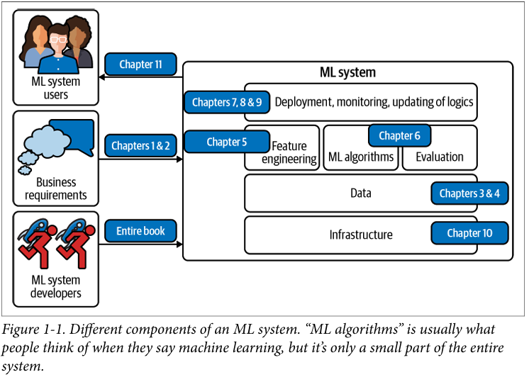

* Since then, more and more companies have turned toward ML for solutions to their
most challenging problems.

* Yet there are still many more use cases for ML waiting to be
explored in fields such as health care, transportation, farming, and even in helping us
understand the universe.2

---
## The Relationship Between MLOps and ML Systems Design
--
* Ops in MLOps comes from DevOps, short for Developments and
Operations. To operationalize something means to bring it into
production, which includes deploying, monitoring, and maintain
ing it. MLOps is a set of tools and best practices for bringing ML
into production.

---
* 

---

## When to Use Machine Learning
---
* As its adoption in the industry quickly grows, ML has proven to be a powerful tool
for a wide range of problems. Despite an incredible amount of excitement and hype
generated by people both inside and outside the field, ML is not a magic tool that can
solve all problems. 

```
Machine learning is an approach to (1) learn (2) complex patterns from (3) existing
data and use these patterns to make (4) predictions on (5) unseen data.
```
```
ML systems learn from data
```

1. Learn: the system has the capacity to learn

```
A relational database isn’t an ML system because it doesn’t have the capacity
to learn. 
```

2. Complex patterns: there are patterns to learn, and they are complex

```
ML has been very successful with tasks with complex patterns such as object
detection and speech recognition
```

3. Existing data: data is available, or it’s possible to collect data

```
Because ML learns from data, there must be data for it to learn from.
```

4. Predictions: it’s a predictive problem

```
ML models make predictions, so they can only solve problems that require
predictive answers.
```

5. Unseen data: unseen data shares patterns with the training data
```
The patterns your model learns from existing data are only useful if unseen data
also share these patterns.
```
6. It’s repetitive

7. The cost of wrong predictions is cheap

```
 ML is
especially suitable when the cost of a wrong prediction is low.

Developing self-driving cars is challenging because an
algorithmic mistake can lead to death. However, many companies still want to
develop self-driving cars because they have the potential to save many lives once
self-driving cars are statistically safer than human drivers.
```

8. It’s at scale

```
“At scale” means different things for different tasks, but, in general, it means
making a lot of predictions. Examples include sorting through millions of emails
a year or predicting which departments thousands of support tickets should be
routed to a day.
```

9. The patterns are constantly changing
```
Cultures change. Tastes change. Technologies change. What’s trendy today might
be old news tomorrow. Consider the task of email spam classification. Today
an indication of a spam email is a Nigerian prince, but tomorrow it might be a
distraught Vietnamese writer.
```

##### Most ImP
```
“Continual Learning”
```
### Machine Learning Use Cases


* 
* 
* 
* 
* 
* 
* 
* 
* 
* 
* 
* 
* 
* 
* 


```
SFD
```

---
DFG
---